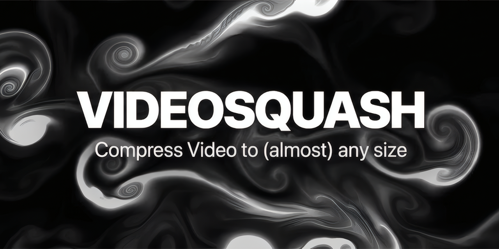

# VideoSquash




VideoSquash is a video compression web app built with a React frontend and a FastAPI backend. It lets users upload a video, choose a target size, trim the clip, mute audio, crop aspect ratio, and pick a resolution before sending the job to the backend for FFmpeg processing.

The app is designed to stay simple for end users while still being practical for developers:

- upload a video and compress it in a few clicks
- monitor upload and processing progress in the browser
- restore the selected file and active job after a refresh
- run everything either locally or with Docker Compose

## What The Project Does

VideoSquash provides a browser-based workflow for reducing video size without requiring users to work directly with FFmpeg commands.

The backend accepts uploads, queues jobs, and processes them with FFmpeg. The frontend provides the upload form, live job status, automatic download support, and a fluid animated background.

## Why It Is Useful

- It gives non-technical users a straightforward way to compress videos.
- It exposes common compression controls such as target size, trimming, mute, crop, and resolution.
- It supports long-running jobs with live progress updates over WebSocket.
- It keeps the selected file in browser storage so work is easier to resume after a refresh.
- It is easy to run in a local dev environment or inside containers.

## Getting Started

### Prerequisites

For local development you will need:

- Python 3.11+
- Node.js 20+
- `ffmpeg` and `ffprobe` on your PATH
- Docker and Docker Compose if you want the containerized setup

### Recommended: Docker Compose

The fastest way to run the project is with Docker Compose:

```bash
docker compose up --build
```

This starts:

- the FastAPI backend on port `8000`
- the frontend on port `80`

Open the frontend in your browser and upload a video to start a compression job.

### Local Development

#### 1. Clone and configure

```bash
git clone <your-repo-url>
cd VideoSquash
```

If you want to override defaults, copy the example environment file and edit it as needed:

```bash
copy .env.example .env
```

The current environment surface is documented in [`.env.example`](.env.example).

#### 2. Start the backend

```bash
cd backend
python -m venv .venv
.\.venv\Scripts\Activate.ps1
pip install -r requirements.txt
uvicorn main:app --reload --host 0.0.0.0 --port 8000
```

The backend uses these environment variables:

- `LOG_LEVEL`
- `HOST`
- `PORT`
- `USE_NVENC`
- `UPLOAD_RATE_LIMIT`
- `STATUS_RATE_LIMIT`
- `DOWNLOAD_RATE_LIMIT`

#### 3. Start the frontend

```bash
cd frontend
npm install
npm run dev
```

The frontend uses `VITE_API_BASE` to point at the backend. In local development it defaults to `/api`, which matches the Vite proxy in [`frontend/vite.config.js`](frontend/vite.config.js).

### Typical Usage

1. Open the app in your browser.
2. Upload a video.
3. Set the target size and optional trim/crop settings.
4. Click **Squash Video**.
5. Wait for the job to complete and download the result.

If you refresh while a job is active, the app will try to restore the in-progress session.

## Help And Documentation

Start with these files when you need setup or runtime details:

- [`.env.example`](.env.example) for supported configuration values
- [`docker-compose.yml`](docker-compose.yml) for the container layout
- [`backend/main.py`](backend/main.py) for API routes and rate limits
- [`frontend/src/App.jsx`](frontend/src/App.jsx) for the main UI flow
- [`frontend/src/hooks/useJobWebSocket.js`](frontend/src/hooks/useJobWebSocket.js) for job status handling
- [`frontend/README.md`](frontend/README.md) for frontend-specific notes

If you are using the repository as a consumer or contributor, open an issue or discussion in the project host when you need help that is not covered here.

## Who Maintains And Contributes

VideoSquash is maintained by the repository contributors.

Contributions are welcome through pull requests. Keep changes focused, follow the existing code style, and run the relevant checks before opening a PR:

- `npm run build` in `frontend/`
- `python -m py_compile backend/main.py` from the repo root

If you add new configuration or setup steps, update [`.env.example`](.env.example) and this README together so they stay in sync.

## Repository Layout

```text
backend/    FastAPI service, queue management, and FFmpeg processing
frontend/   React app, UI components, and Vite configuration
assets/     Repository banner
```
